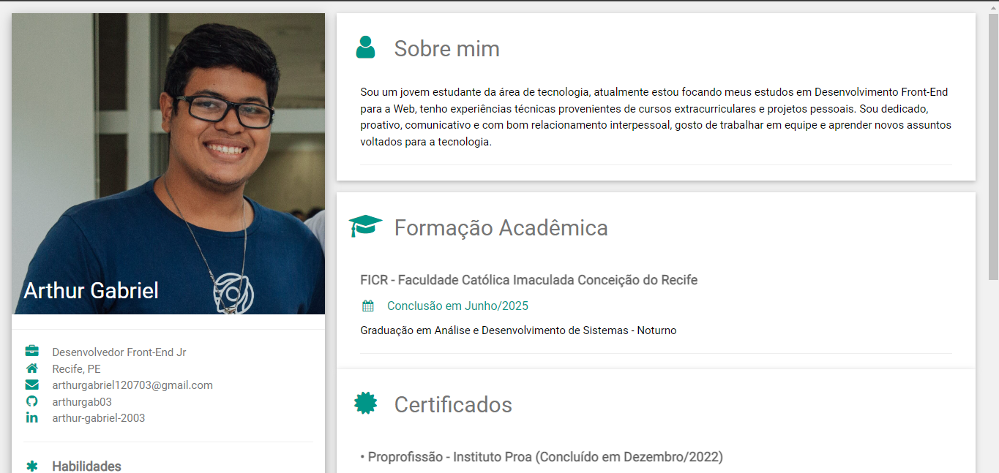

# Curriculum Vitae

## Descrição:

- Projeto desenvolvido com os conhecimentos adquiridos no bootcamp Ifood Angular Developer da Digital Innovation One. O projeto é um   modelo de currículo virtual e responsivo para telas de diversos dispositivos.

 

    

## Tecnologias utilizadas: 

- • HTML
- • CSS

## Links úteis:

- [Clique aqui para visualizar o projeto](https://arthurgab03.github.io/curriculum-vitae/index.html)

- [O template do projeto foi fornecido por w3schools](https://www.w3schools.com/w3css/default.asp)

